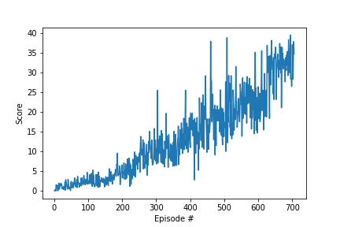

# Project Report for Reacher Environment Project

## Learning Algorithm

### Experiment 1

#### Baseline Model

**Actor Model:**

- Fully connected layer - Input: state_size (int), Output: 256
- Fully connected layer - Input: 256, Output: action_size (int)

**Critic Model:**

- Fully connected layer - Input: state_size (int), Output: 256
- Fully connected layer - Input: 256 + action_size (int), Output: 256
- Fully connected layer - Input: 256, Output: 128
- Fully connected layer - Input: 128, Output: 1 (scalar Q-value)

During the initial training, the following hyperparameters were used:

- BUFFER_SIZE = int(1e6)  
- BATCH_SIZE = 128        
- GAMMA = 0.99            
- TAU = 1e-3              
- LR_ACTOR = 1e-4         
- LR_CRITIC = 3e-4       
- WEIGHT_DECAY = 0.0001   

#### Experimental Model v1

**Actor Model:**
- Fully connected layer - Input: state_size (int), Output: 256
- Fully connected layer - Input: 256, Output: 256
- Fully connected layer - Input: 256, Output: action_size (int)
- Activation function: ReLU for all hidden layers, hyperbolic tangent (tanh) for the output layer.

**Critic Model:**
- Fully connected layer - Input: state_size (int), Output: 256
- Fully connected layer - Input: 256 + action_size (int), Output: 256
- Fully connected layer - Input: 256, Output: 128
- Fully connected layer - Input: 128, Output: 1 (scalar Q-value)
- Activation function: ReLU for all hidden layers, linear (no activation) for the output layer.

During the initial training, the following hyperparameters were used:

- BUFFER_SIZE = int(1e6)  
- BATCH_SIZE = 128        
- GAMMA = 0.99            
- TAU = 1e-3              
- LR_ACTOR = 1e-4         
- LR_CRITIC = 3e-4       
- WEIGHT_DECAY = 0.0001  

#### Experimental Model v2

**Actor Model:**
- Fully connected layer - Input: state_size (int), Output: 350
- Fully connected layer - Input: 350, Output: 280
- Fully connected layer - Input: 280, Output: action_size (int)
- Batch Normalization layers added after the first and second hidden layers.
- Activation function: ReLU for all hidden layers, hyperbolic tangent (tanh) for the output layer.

**Critic Model:**
- Fully connected layer - Input: state_size (int), Output: 350
- Fully connected layer - Input: 350 + action_size (int), Output: 280
- Fully connected layer - Input: 280, Output: 1 (scalar Q-value)
- Batch Normalization layers added after the first and second hidden layers.
- Activation function: ReLU for all hidden layers, linear (no activation) for the output layer.

Note: The weight initialization for all layers is performed using the Kaiming initialization (He initialization) with a ReLU activation. The bias values are set to 0.1.

During the initial training, the following hyperparameters were used:

- BUFFER_SIZE = int(1e6)  
- BATCH_SIZE = 128        
- GAMMA = 0.99            
- TAU = 1e-3              
- LR_ACTOR = 1e-4         
- LR_CRITIC = 3e-4       
- WEIGHT_DECAY = 0.0001  

#### Experimental Model v3

**Actor Model:**
- Fully connected layer - Input: state_size (int), Output: 400
- Fully connected layer - Input: 400, Output: 300
- Fully connected layer - Input: 300, Output: action_size (int)
- Batch Normalization layers added after the first and second hidden layers.
- Activation function: ReLU for all hidden layers, hyperbolic tangent (tanh) for the output layer.

**Critic Model:**
- Fully connected layer - Input: state_size (int), Output: 400
- Fully connected layer - Input: 400 + action_size (int), Output: 300
- Fully connected layer - Input: 300, Output: 1 (scalar Q-value)
- Batch Normalization layers added after the first and second hidden layers.
- Activation function: ReLU for all hidden layers, linear (no activation) for the output layer.

Note: The weight initialization for all layers is performed using the Kaiming initialization (He initialization) with a ReLU activation. The bias values are set to 0.1.

During the initial training, the following hyperparameters were used:

- BUFFER_SIZE = int(1e6)  
- BATCH_SIZE = 128        
- GAMMA = 0.99            
- TAU = 1e-3              
- LR_ACTOR = 1e-4         
- LR_CRITIC = 3e-4       
- WEIGHT_DECAY = 0.0001 

#### Conclusion

| Architecture | Average Training Time | Episodes | Average Score (Training) | Average Score (Inference) | Plot |
|--------------|-----------------------|----------|------------------------|-------------------------|------|
| Baseline | --- | 500 | 0.17 | 0.07 |  |
| Experimental v1 | --- | 500 | 0.01 | 0.01 |  |
| Experimental v2 | --- | 500 | 0.36 | 0.82 |  |
| Experimental v3 | --- | 500 | 0.32 | 0.23 |  |

- The reason for testing the architecture with additional layers was to potentially increase the capacity of the neural network and enable it to learn more complex representations of the environment. According to the results, `experiment_v2` architecture perfome well but had a crash which did not recover.
- I have then tried the same `experiment_v2` model on GPU workspace to check the performance, but the workspace failed to run for some reason.

#### Hyperparameters Tuning Results

- **Updated Hyperparameters:**

  - BUFFER_SIZE = int(1e6)  
  - BATCH_SIZE = 128        
  - GAMMA = 0.99            
  - TAU = 1e-3              
  - LR_ACTOR = 1e-3        
  - LR_CRITIC = 3e-3       
  - WEIGHT_DECAY = 0.0001
  - Added the gradient clipping and learning timestep intervals
  - **Fail**

- **Updated Hyperparameters:**

  - OUNoise theta=0.05, sigma=0.1
  - **Fail**

- **Updated Hyperparameters:**

  - BUFFER_SIZE = int(1e5)
  - OUNoise theta=0.2, sigma=0.15
  - **Fail**

- **Updated Hyperparameters:**

  - BUFFER_SIZE = int(1e6)
  - WEIGHT_DECAY = 0.00001
  - OUNoise theta=0.15, sigma=0.05
  - **Fail**

- **Updated Hyperparameters:**

  - OUNoise theta=0.15, sigma=0.15
  - Added epsilon decay
  - **Fail**

- **Updated Hyperparameters:**

  - max_t= 1000
  - **Fail**

### Experiment 2

#### Experimental Model v4

**Actor Model:**
- Fully connected layer - Input: state_size (int), Output: 128
- Fully connected layer - Input: 128, Output: 256
- Fully connected layer - Input: 256, Output: action_size (int)
- Batch Normalization layer added after the first hidden layer (fc1) with a momentum of 1.
- Dropout with a probability of 0.20 applied after the second hidden layer (fc2).
- Activation function: ReLU for all hidden layers, hyperbolic tangent (tanh) for the output layer.

**Critic Model:**
- Fully connected layer - Input: state_size (int), Output: 128
- Fully connected layer - Input: 128 + action_size (int), Output: 256
- Fully connected layer - Input: 256, Output: 1 (scalar Q-value)
- Batch Normalization layer added after the first hidden layer (fc1) with a momentum of 1.
- Dropout with a probability of 0.20 applied after the second hidden layer (fc2).
- Activation function: ReLU for all hidden layers, linear (no activation) for the output layer.

**Weight Initialization:**
- Weight initialization for both models uses the Kaiming initialization (He initialization).
- Bias values are initialized to 0.1.

During the initial training, the following hyperparameters were used:

- BUFFER_SIZE = int(1e6)  
- BATCH_SIZE = 128        
- GAMMA = 0.95            
- TAU = 1e-3              
- LR_ACTOR = 1e-4         
- LR_CRITIC = 3e-3       
- WEIGHT_DECAY = 0 

#### Conclusion

| Architecture | Average Training Time | Episodes | Average Score (Training) | Average Score (Inference) | Plot |
|--------------|-----------------------|----------|------------------------|-------------------------|------|
| Experimental v4 | 1201.58 | 195 | 1.01 | 2.67 |  |

## Results

| Average Training Time | Episodes | Average Score (Training) | Average Score (Inference) | Plot |
|-----------------------|----------|------------------------|-------------------------|------|
| 6178.78 | 605 | 30.07 | 36.23 |  |

By performing hyperparameter tuning and retraining the model, I successfully improved the agent's performance. The chosen hyperparameters for the above training session resulted in the fastest training time and achieved the highest average score at convergence.

## Ideas for Future Work

1. **Comparative Analysis of RL Algorithms:** Conduct a comprehensive comparative analysis of various reinforcement learning algorithms, including REINFORCE, TNPG, RWR, REPS, TRPO, CEM, CMA-ES, and DDPG, in continuous control tasks. Evaluate their performance in terms of convergence speed, sample efficiency, and stability. This analysis will provide insights into the strengths and weaknesses of different algorithms and help identify the most suitable approach for specific continuous control scenarios.

2. **Prioritized Experience Replay in DDPG:** Integrate prioritized experience replay into the DDPG algorithm and investigate its impact on learning efficiency and performance. Analyze how prioritizing important experiences affects the agent's ability to learn and improve its policy. This exploration can lead to improvements in the DDPG algorithm and enhance its performance in challenging continuous control tasks.

3. **Try out Crawler Environment**

